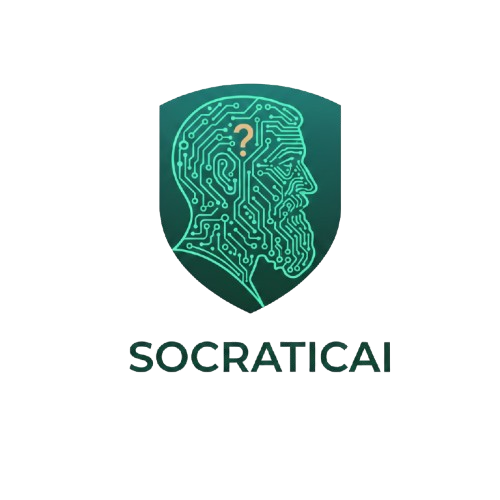

# 🧠 Learning Assistant



## Introduction

The Learning Assistant is an AI-powered chatbot designed to help users learn and research various topics. It provides a conversational interface to access information from the web and scientific articles, making learning more interactive and engaging.

## Key Features

*   **Conversational Interface:** Ask questions and get answers in a natural, conversational way.
*   **Two Specialized Agents:**
    *   **General Search:** For general knowledge and web search.
    *   **Scientific Search:** For in-depth research using scientific articles from ArXiv.
*   **User-Friendly Interface:** A clean and intuitive interface built with Streamlit.
*   **Dark/Light Mode:** Adapts to your system's theme for a comfortable viewing experience.

## How to Get Started

1.  **Clone the repository:**
    ```bash
    git clone https://github.com/your-username/your-repository.git
    ```
2.  **Install the dependencies:**
    ```bash
    pip install -r requirements.txt
    ```
3.  **Run the application:**
    ```bash
    streamlit run interface/app.py
    ```

## Potential Impact

The Learning Assistant aims to democratize access to information and make learning more accessible to everyone. By providing a simple and intuitive interface to complex information sources, it can help students, researchers, and lifelong learners to:

*   **Quickly find information:** Get answers to your questions without having to sift through pages of search results.
*   **Deepen your understanding:** Explore topics in-depth by accessing scientific articles and research papers.
*   **Stay up-to-date:** Keep up with the latest research in your field.

We believe that the Learning Assistant has the potential to be a valuable tool for anyone who is curious about the world and wants to learn new things.
